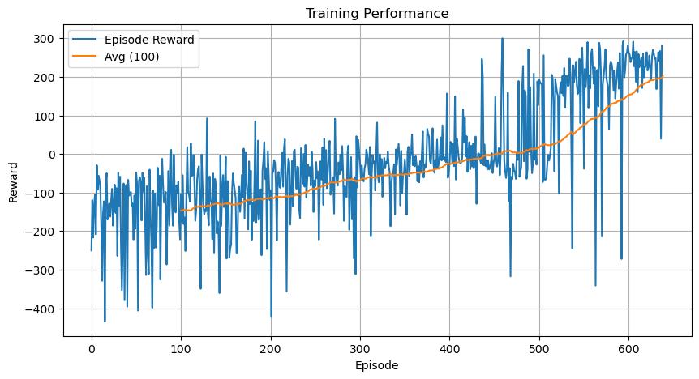
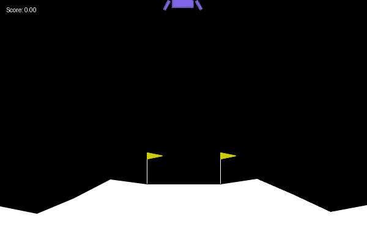

# LunarLander_v3
CSPB Final Project Lunar Lander v3

# 1. Project Overview

This project applies Deep Q-Network (DQN) reinforcement learning to solve the LunarLander-v3 environment from OpenAI Gymnasium.

The goal is to train an agent to land a spacecraft safely between two flags using only thrust-based actions. The agent learns a policy through trial and error by interacting with the environment.

### Objectives:
- Implement a custom DQN agent
- Train the agent to solve the environment
- Monitor performance using reward trends and average scores
- Generate a demo `.gif` of successful landings

# 2. Environment Setup

The LunarLander environment simulates a spacecraft descending toward a landing pad.

### Game Rules:
- The goal is to land the spacecraft between the flags without crashing.
- The lander has 4 actions:
  1. Do nothing
  2. Fire left orientation engine
  3. Fire main engine
  4. Fire right orientation engine
- The agent receives:
  - Positive reward for landing between the flags
  - Negative reward for crashing or flying out of bounds
  - Small rewards for controlled descent

### Observation Space:
- An 8-dimensional continuous vector:
  - position (x, y)
  - linear velocities (vx, vy)
  - angle
  - angular velocity
  - left leg contact (bool)
  - right leg contact (bool)

### Action Space:
- A discrete set of 4 actions

# 3. Model & Approach

We use a Deep Q-Network (DQN) for this problem. The DQN approximates the Q-values for each state-action pair using a feedforward neural network.

### Why DQN?
LunarLander has a continuous observation space and a discrete action space, making it a good fit for DQN. The agent learns from past experiences using experience replay and target networks to stabilize training.

The model is trained using the Bellman equation with temporal difference updates.

Below is the full implementation of:
- Q-Network (`DQN Network`)
- Experience Replay (`ReplayBuffer`)
- Agent (`DQN Agent`)
- Training function with comments

### DQN

class DQNNetwork(nn.Module):
    def __init__(self, input_dim, output_dim, hidden_layers=[128, 128]):
        super(DQNNetwork, self).__init__()
        layers = []

        prev_size = input_dim
        for h in hidden_layers:
            layers.append(nn.Linear(prev_size, h))
            layers.append(nn.ReLU())
            prev_size = h

        layers.append(nn.Linear(prev_size, output_dim))
        self.model = nn.Sequential(*layers)

    def forward(self, x):
        return self.model(x)

### Replay Buffer

class ReplayBuffer:
    def __init__(self, capacity, batch_size):
        self.memory = deque(maxlen=capacity)
        self.batch_size = batch_size
        self.experience = namedtuple("Experience",
                                     field_names=["state", "action", "reward", "next_state", "done"])

    def __len__(self):
        return len(self.memory)

    def add(self, state, action, reward, next_state, done):
        e = self.experience(state, action, reward, next_state, done)
        self.memory.append(e)

    def sample(self):
        batch = random.sample(self.memory, k=self.batch_size)
        states = torch.tensor(np.vstack([e.state for e in batch]), dtype=torch.float32).to(device)
        actions = torch.tensor(np.vstack([e.action for e in batch]), dtype=torch.int64).to(device)
        rewards = torch.tensor(np.vstack([e.reward for e in batch]), dtype=torch.float32).to(device)
        next_states = torch.tensor(np.vstack([e.next_state for e in batch]), dtype=torch.float32).to(device)
        dones = torch.tensor(np.vstack([e.done for e in batch]).astype(np.uint8), dtype=torch.float32).to(device)

        return states, actions, rewards, next_states, dones

### DQN Agent Class

class DQNAgent:
    def __init__(self, state_size, action_size, buffer_size = 100000, batch_size=64,
                 gamma = 0.99, lr = 1e-3, tau = 1e-3, update_every = 4):

        self.state_size = state_size
        self.action_size = action_size
        self.batch_size = batch_size
        self.gamma = gamma
        self.tau = tau
        self.update_every = update_every

        # Networks
        self.qnetwork_local = DQNNetwork(state_size, action_size).to(device)
        self.qnetwork_target = DQNNetwork(state_size, action_size).to(device)
        self.optimizer = optim.Adam(self.qnetwork_local.parameters(), lr=lr)

        # Replay buffer
        self.memory = ReplayBuffer(buffer_size, batch_size)
        self.t_step = 0

    def act(self, state, eps=0.0):
        state = torch.from_numpy(state).float().unsqueeze(0).to(device)
        self.qnetwork_local.eval()
        with torch.no_grad():
            q_values = self.qnetwork_local(state)
        self.qnetwork_local.train()

        if random.random() < eps:
            return random.choice(np.arange(self.action_size))
        else:
            return np.argmax(q_values.cpu().data.numpy())

    def step(self, state, action, reward, next_state, done):
        self.memory.add(state, action, reward, next_state, done)
        self.t_step = (self.t_step + 1) % self.update_every

        if self.t_step == 0 and len(self.memory) >= self.batch_size:
            experiences = self.memory.sample()
            self.learn(experiences)

    def learn(self, experiences):
        states, actions, rewards, next_states, dones = experiences

        q_targets_next = self.qnetwork_target(next_states).detach().max(1)[0].unsqueeze(1)
        q_targets = rewards + (self.gamma * q_targets_next * (1 - dones))
        q_expected = self.qnetwork_local(states).gather(1, actions)

        loss = nn.MSELoss()(q_expected, q_targets)
        self.optimizer.zero_grad()
        loss.backward()
        self.optimizer.step()

        self.soft_update()

    def soft_update(self):
        for target_param, local_param in zip(self.qnetwork_target.parameters(),
                                              self.qnetwork_local.parameters()):
            target_param.data.copy_(self.tau * local_param.data + (1.0 - self.tau) * target_param.data)

### DQN Training Loop

def train_dqn(env, agent, n_episodes = 1000, max_t = 1000,
              eps_start = 1.0, eps_end = 0.01, eps_decay = 0.995,
              target_score = 200.0, save_path = "dqn_lander.pth", verbose = True):
    
    scores = []  # All episode rewards
    scores_window = deque(maxlen = 100)  # Sliding window for average reward
    epsilon = eps_start  # Starting exploration rate

    bar = trange(n_episodes, desc = "Training", ascii = True)  # Progress bar
    for i_episode in bar:
        state, _ = env.reset()  # Reset environment
        total_reward = 0  # Episode reward counter

        for t in range(max_t):
            action = agent.act(state, eps = epsilon)  # Select action using ε-greedy
            next_state, reward, done, truncated, _ = env.step(action)  # Take step
            agent.step(state, action, reward, next_state, done)  # Store + learn
            state = next_state  # Move to next state
            total_reward += reward  # Update episode reward

            if done or truncated:  # Stop if episode ends
                break

        scores.append(total_reward)  # Store score
        scores_window.append(total_reward)  # Update moving average

        epsilon = max(eps_end, eps_decay * epsilon)  # Decay epsilon
        avg_score = np.mean(scores_window)  # Average of last 100 episodes

        # Show info in progress bar
        bar.set_postfix({
            "Epsilon": f"{epsilon:.3f}",
            "Score": f"{total_reward:.1f}",
            "Avg100": f"{avg_score:.1f}"
        })

        # Print every 100 episodes if enabled
        if verbose and (i_episode + 1) % 100 == 0:
            print(f"\nEpisode {i_episode + 1} | Average Score (last 100): {avg_score:.2f}")

        # Stop early if average score is good
        if avg_score >= target_score:
            print(f"\nEnvironment solved in {i_episode + 1} episodes! Avg score: {avg_score:.2f}")
            torch.save(agent.qnetwork_local.state_dict(), save_path)  # save model
            break

    # Save model at the end
    if avg_score < target_score:
        print(f"\n Training ended after {n_episodes} episodes. Best avg score: {avg_score:.2f}")
        torch.save(agent.qnetwork_local.state_dict(), save_path)

    return scores  # Return list of all episode rewards

### Training Model

device = torch.device("cuda" if torch.cuda.is_available() else "cpu")

# Create the LunarLander-v3 environment
env = gym.make("LunarLander-v3")

# Get the number of input features (state size)
state_dim = env.observation_space.shape[0]

# Get the number of possible actions (action size)
action_dim = env.action_space.n

# Create the DQN agent using state and action dimensions
agent = DQNAgent(state_size = state_dim, action_size = action_dim)

# Train the agent and collect episode scores
scores = train_dqn(env, agent, n_episodes = 1000, target_score = 200)

# 4. Troubleshooting & Improvements

During early experiments, the agent struggled to consistently achieve high rewards. To improve learning performance, the following steps were taken:

### Key Adjustments:
- **Training Duration:** Increased the number of episodes to allow more learning opportunities.
- **Replay Buffer Size:** Ensured a large memory buffer (100,000+ transitions) for stable learning.
- **Soft Updates:** Used a `tau` value of `1e-3` for gradual target network updates.
- **Reward Monitoring:** Logged average reward across episodes and implemented early stopping.

### Evaluation Data

The test episode results were saved to a `.csv` and are shown below:

import pandas as pd

# Load and display test reward results
df_results = pd.read_csv("results/dqn_test_results.csv")
df_results

# 5. Results

### Reward Trends

The following plot shows the episode rewards across training. The orange line represents the moving average over 100 episodes.

# 6. Conclusion & Discussion

### What Worked
- The DQN agent successfully learned to land the LunarLander with increasing consistency.
- Soft target updates and a replay buffer helped stabilize learning.
- The reward curve showed clear upward trends after sufficient training time.

### What Didn’t Work
- Early training showed unstable performance when:
  - The replay buffer was too small
  - The agent was trained for too few episodes
  - Rendering was accidentally enabled during training (slowed down runs)

### Future Improvements
- **Reward Shaping:** Add bonuses for slowing descent or staying upright to encourage smoother landings.
- **Longer Training:** Additional episodes could push average reward even higher and faster.
- **Model Comparison:** Test alternative algorithms like PPO, A2C, or Dueling DQNs to see how they perform on the same task.
- **Hyperparameter Search:** Explore different learning rates, batch sizes, or epsilon decay schedules.

# 7. Deliverables

### Code Repository
- GitHub URL: https://github.com/PeytonCunningham/LunarLander_v3.git

### Demo Video / GIF
- Demo of trained agent landing:  
  

### References
- [OpenAI Gymnasium: LunarLander Environment](https://www.gymlibrary.dev/environments/box2d/lunar_lander/)
- [PyTorch Documentation](https://pytorch.org/docs/stable/index.html)
- [TQDM Progress Bars](https://github.com/tqdm/tqdm)
- [Matplotlib Plotting](https://matplotlib.org/stable/index.html)
- [Pillow for Text Overlay](https://pillow.readthedocs.io/en/stable/)

### Files in `results/` Folder:
- `dqn_training_performance.png` – reward plot
- `dqn_test_results.csv` – test episode scores
- `dqn_demo.gif` – recorded landing
